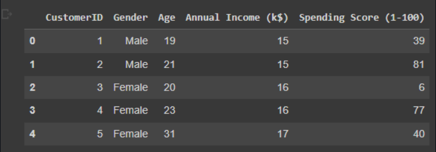
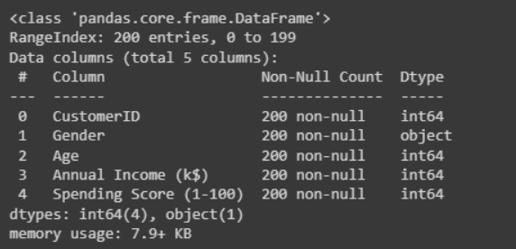
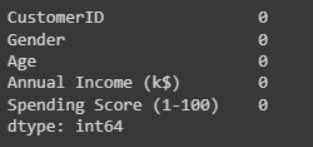
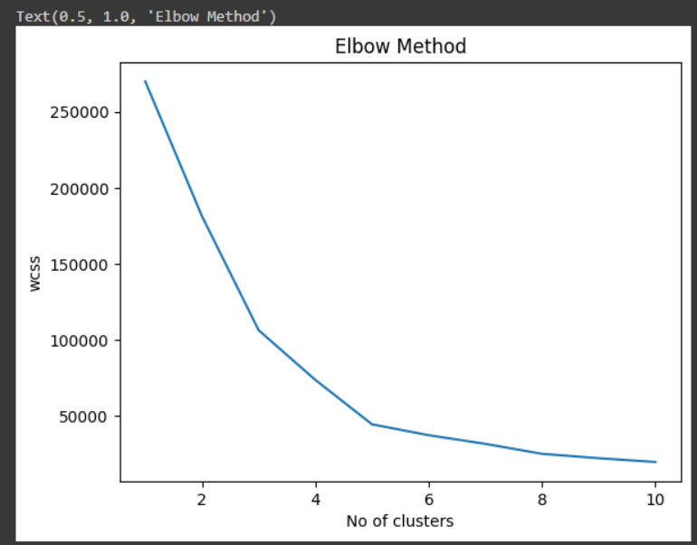

# Implementation-of-K-Means-Clustering-for-Customer-Segmentation

## AIM:
To write a program to implement the K Means Clustering for Customer Segmentation.

## Equipments Required:
1. Hardware – PCs
2. Anaconda – Python 3.7 Installation / Jupyter notebook

## Algorithm
1. Import dataset and print head,info of the dataset

2. check for null values

3. Import kmeans and fit it to the dataset

4. Plot the graph using elbow method

5. Print the predicted array

6. Plot the customer segments

## Program:
```
/*
Program to implement the K Means Clustering for Customer Segmentation.
Developed by: AKSHITH JOBIRIN S
RegisterNumber: 212220040007 
*/

import pandas as pd
import matplotlib.pyplot as plt
data=pd.read_csv("/content/Mall_Customers (1).csv")

data.head()
data.info()
data.isnull().sum()

from sklearn.cluster import KMeans
wcss=[] #within cluster sum of square

for i in range(1,11):
  kmeans = KMeans(n_clusters=i,init="k-means++")
  kmeans.fit(data.iloc[:,3:])
  wcss.append(kmeans.inertia_)
  plt.plot(range(1,11),wcss)

plt.xlabel("No of clusters")
plt.ylabel("wcss")
plt.title("Elbow Method")
km=KMeans(n_clusters=5)
km.fit(data.iloc[:,3:])
y_pred=km.predict(data.iloc[:,3:])
y_pred

data["cluster"]=y_pred
df0=data[data["cluster"]==0]
df1=data[data["cluster"]==1]
df2=data[data["cluster"]==2]
df3=data[data["cluster"]==3]
df4=data[data["cluster"]==4]

plt.scatter(df0["Annual Income (k$)"],df0["Spending Score (1-100)"],c="red",label="cluster0")
plt.scatter(df1["Annual Income (k$)"],df1["Spending Score (1-100)"],c="black",label="cluster1")
plt.scatter(df2["Annual Income (k$)"],df2["Spending Score (1-100)"],c="blue",label="cluster2")
plt.scatter(df3["Annual Income (k$)"],df3["Spending Score (1-100)"],c="green",label="cluster3")
plt.scatter(df4["Annual Income (k$)"],df4["Spending Score (1-100)"],c="magenta",label="cluster4")
plt.legend()

plt.title("customer segments")

```

## Output:
### 1. data.head() function:



### 2. data.info():



### 3.data.isnull().sum() function:



### 4. Elbow method Graph:



### 5. KMeans Clusters:


### 6. Customer segments Graph:


## Result:
Thus the program to implement the K Means Clustering for Customer Segmentation is written and verified using python programming.
